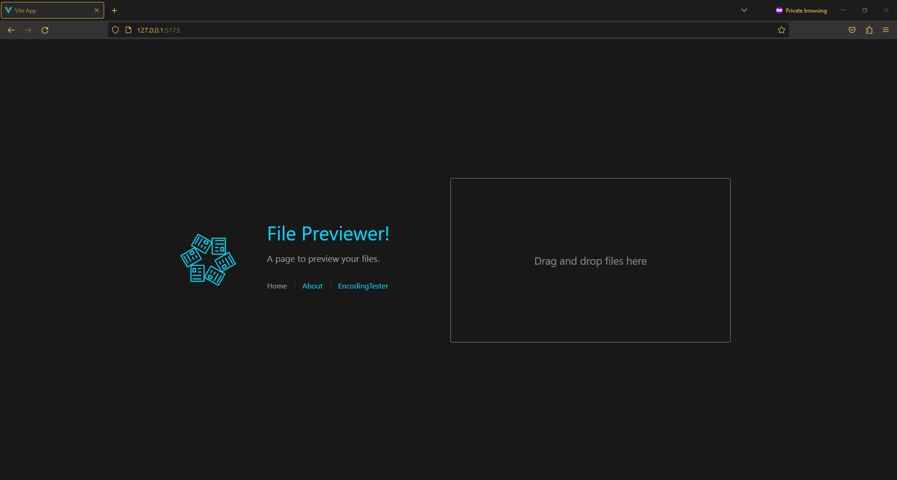
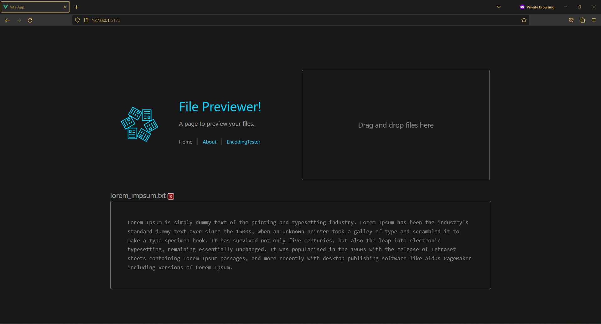
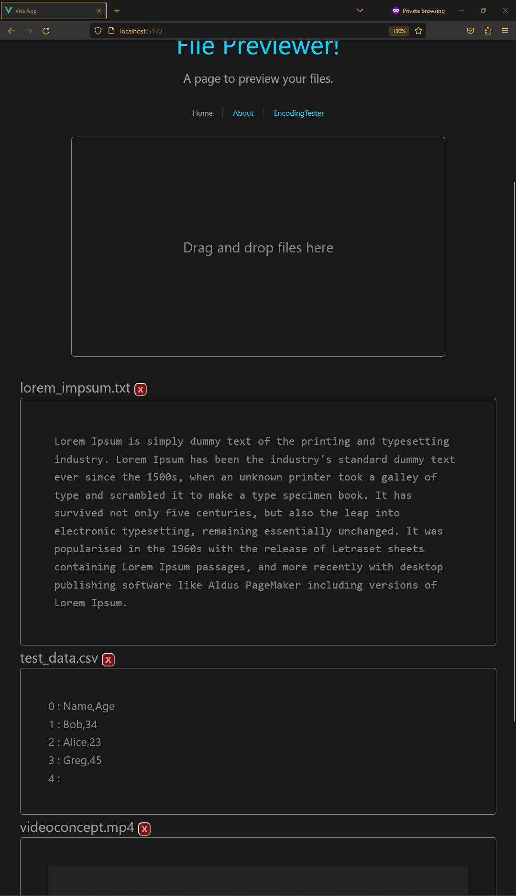
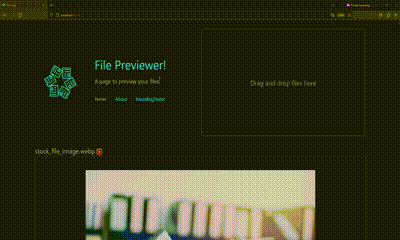
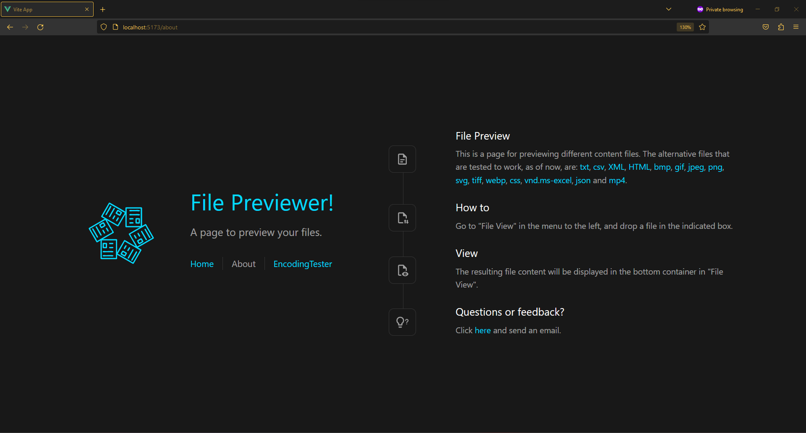
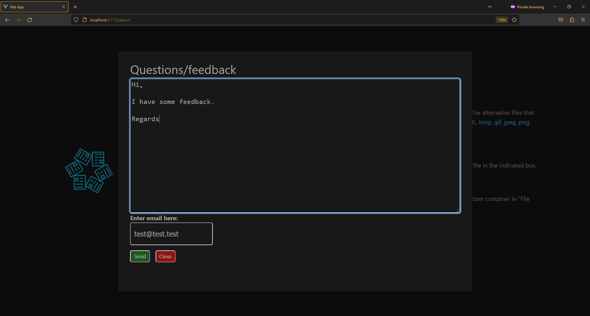
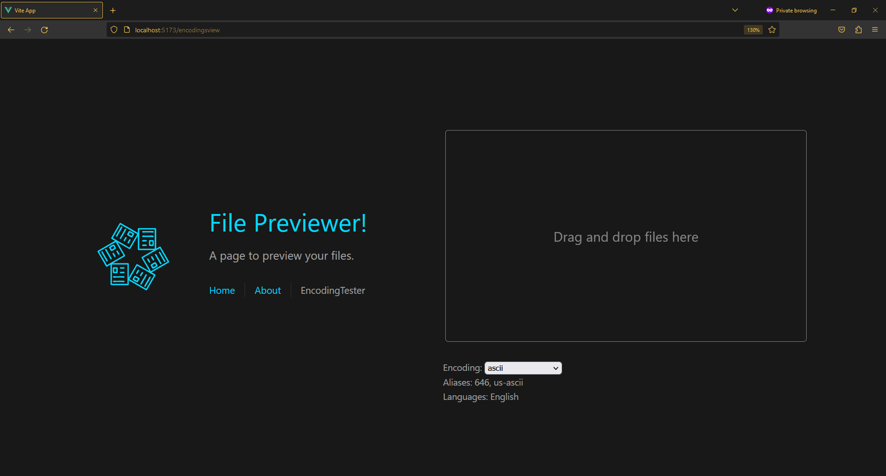

# 📂 file-preview

Drop files in the browser window, and preview them.



The prieview appears below.



Drop several files and they all appear.



The images can be removed (artifacts on gif after conversion...):
<div style="text-align:center"></div>

## About page

An about page with "How to" and supported files.



## Feedback popup

A feedback email-popup. To be replaced with mailto-link that opens default email client.



## Encoding Tester (Work in progress!)

A page to drop text files and check what encoding they have.




## Project Setup

```sh
npm install
```

### Compile and Hot-Reload for Development

```sh
npm run dev
```

### Compile and Minify for Production

```sh
npm run build
```

### Lint with [ESLint](https://eslint.org/)

```sh
npm run lint
```
---

## Why?

Developed for fun, and to have a project to show for.
